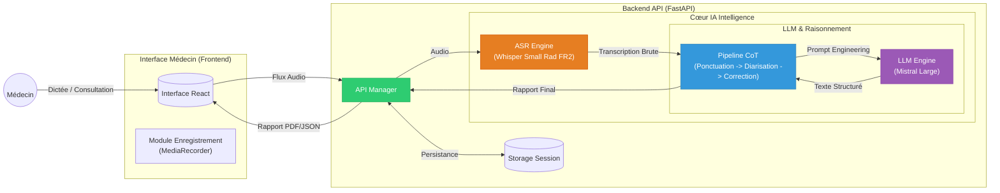
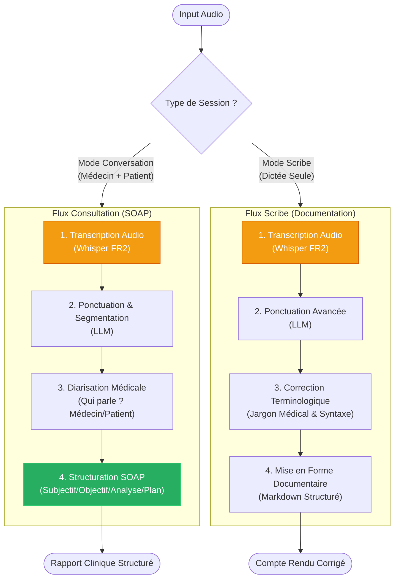
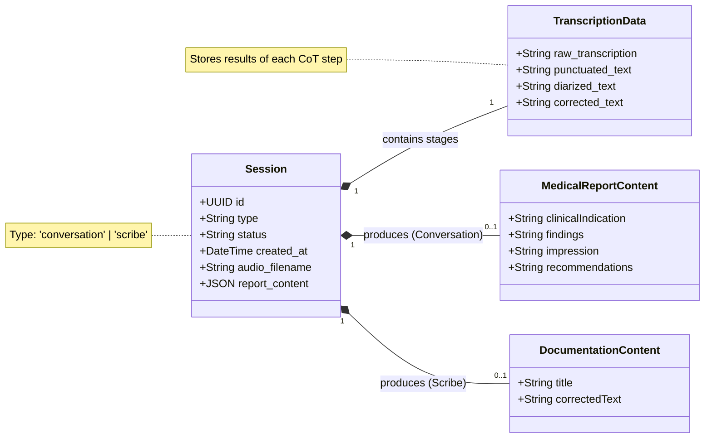

# Diagrammes Architecture - MedVoice AI

Mise à jour suite à l'implémentation du Backend FastAPI.

Le système expose deux modes principaux :
1. **Conversation** : Dialogue Médecin/Patient → Rapport SOAP.
2. **Scribe** : Dictée du médecin → Transcription corrigée.

---

## 1. Architecture Système (Haut Niveau)

Vue d'ensemble de la solution MedVoice AI, montrant les flux de données entre le Médecin, l'Application et les Modèles IA.

---

## 2. Flux de Traitement Intelligent (CoT)

Détail du pipeline de traitement selon le cas d'usage, mettant en avant la logique **Chain of Thought**.

---

## 3. Diagramme de Classes (Modèle de Données)

Reflet du modèle SQLAlchemy et des types Pydantic implémentés.

