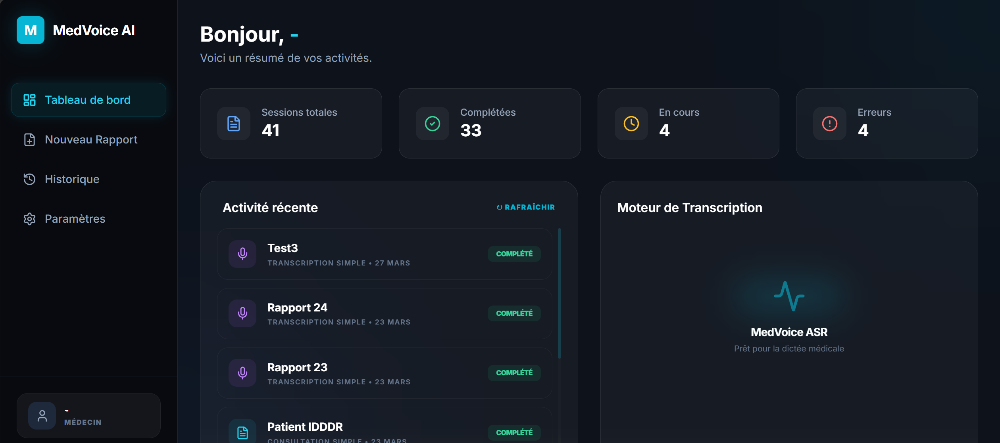
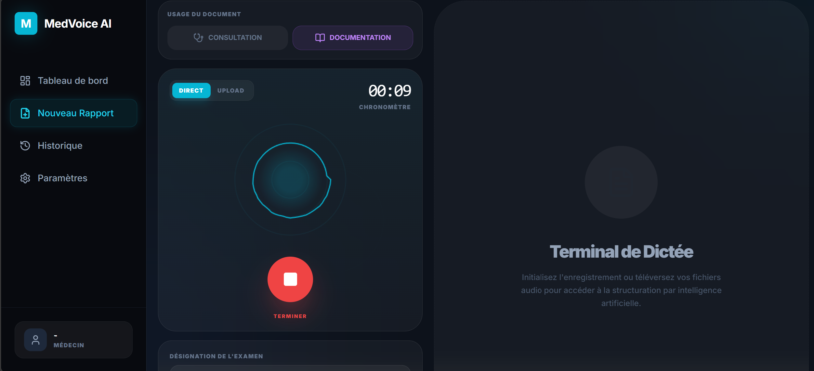
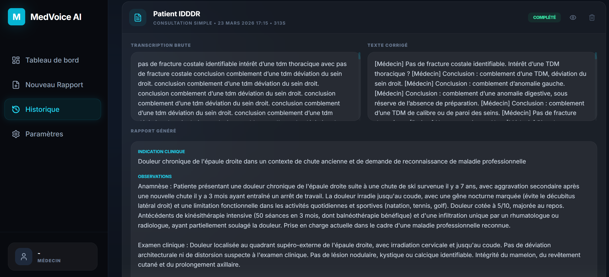

# 🎙️ MedVoice AI

[](https://www.python.org/)
[](https://react.dev/)
[](https://fastapi.tiangolo.com/)
[](https://tailwindcss.com/)
[](https://pytorch.org/)
[](https://github.com)

An intelligent, secure research demonstration system that combines local **Automatic Speech Recognition (ASR)** and state-of-the-art **Large Language Models (LLM)** to transcribe, refine, and structure doctor-patient dialogues and medical dictations into production-ready clinical reports. 

This project was developed as part of a Bachelor's Thesis (*Mémoire de Licence*) at the **Institut de Formation et de Recherche en Informatique (IFRI) / Université d'Abomey-Calavi (UAC)**.

---

## 🎥 Interactive Demo & Gallery

### Video Demo
> 🎥 **[Watch the MedVoice AI Video Demo on Google Drive](https://drive.google.com/file/d/1yJsRxcowIfDsB8hVk3sViRU0DAGNG_lJ/view?usp=drive_link)**

### Screenshots

#### 1. Main Dashboard
The dashboard displays overall clinic statistics (total sessions, completed sessions, pending tasks, errors) along with recent activity logs and local ASR status.


#### 2. Dictation Terminal & Recording
The main workspace where clinicians record or upload audio files to choose between full clinical consultation mode or structured medical scribe mode.


#### 3. Structured Clinical Report View
Shows the raw output from Whisper, the corrected transcript, and the structured clinical report in standard SOAP format generated by Mistral.


---

## ⚙️ Architecture & Data Privacy

```
┌─────────────────────┐       REST API        ┌─────────────────────────┐
│   Frontend (React)  │ ◄──── /api/v1 ──────► │   Backend (FastAPI)     │
│   Vite + TypeScript │       proxy:3000→8000  │   Python + SQLAlchemy   │
│   Tailwind CSS      │                        │   SQLite                │
└─────────────────────┘                        └──────────┬──────────────┘
                                                          │
                                          ┌───────────────┼───────────────┐
                                          ▼                               ▼
                                   ┌─────────────┐                ┌─────────────┐
                                   │  Whisper ASR │                │ Mistral LLM │
                                   │  (local)     │                │ (API cloud) │
                                   │  Audio→Text  │                │ Text→Text   │
                                   └─────────────┘                └─────────────┘
```

> [!IMPORTANT]
> **Strict Data Privacy:** Whisper executes completely locally and never transmits audio payload to external APIs. Mistral only receives sanitized text inputs. The ASR engine never processes text, and the LLM cloud service never processes audio files.

### Model Configurations

| Component | Model ID | Operational Mode / Description |
|-----------|----------|--------------------------------|
| **ASR Engine** | `StephaneBah/Med-Whisper-AfroRad-FR` | Fine-tuned Whisper model specialized for French medical and radiological jargon (Runs locally, GPU/CPU). |
| **LLM Engine** | `mistral-large-latest` (Mistral API) | Advanced Chain-of-Thought (CoT) text correction, speaker diarization synthesis, and SOAP formatting (Runs in cloud). |

### Core Technologies

*   **Frontend:** React 19, TypeScript, Vite, Tailwind CSS, Lucide Icons, Web Audio API
*   **Backend:** FastAPI, Uvicorn, Pydantic, SQLAlchemy ORM, SQLite Database
*   **ASR Execution:** PyTorch, Hugging Face Transformers (Whisper Pipeline), FP16 GPU or FP32 CPU execution
*   **LLM Connection:** Mistral AI API SDK

---

## 🚀 Key Features

### 1. Clinical Consultation Mode (`conversation`)
Converts natural, multi-speaker doctor-patient dialogues into structured medical records.
```
Audio → Whisper ASR → CoT (Punctuation, Diarization, Clinical Correction) → SOAP Report
        (1 Local Call)                     (1 Cloud LLM Call)             (1 Cloud LLM Call)
```
**Generated SOAP Format:**
*   **Subjective (Clinical Indication):** Context, reason for visit, and history of present illness.
*   **Objective (Observations):** Physical findings, clinical examination details.
*   **Assessment (Impression):** Diagnostics, conclusions, and findings.
*   **Plan (Recommendations):** Follow-up directions, prescriptions, and next steps.

### 2. Scribe Documentation Mode (`scribe`)
Transcribes and structures a single-speaker clinician dictation (skips conversational diarization).
```
Audio → Whisper ASR → CoT (Punctuation & Syntax Correction) → Structured Text
        (1 Local Call)                (1 Cloud LLM Call)
```

### 3. Smart Audio Inputs
*   **Live Recording:** Real-time WebM audio capture via browser microphone (MediaRecorder API).
*   **Audio Upload:** Supports direct upload of files (`.mp3`, `.wav`, `.m4a`, `.webm`).

---

## 🛠️ Installation & Setup

### Prerequisites
*   **Python:** Version 3.10 or higher
*   **Node.js:** Version 18 or higher
*   **System Tools:** FFmpeg must be installed and added to your system's `PATH` (`ffmpeg` and `ffprobe`).
*   **Hardware (Recommended):** NVIDIA GPU with CUDA for local Whisper acceleration.
*   **Credentials:** Mistral AI API Key & Hugging Face Access Token.

Verify FFmpeg availability:
```bash
ffmpeg -version
ffprobe -version
```

### 1. Python Backend Setup
Navigate to the root directory and configure the Python virtual environment:
```bash
cd "App Demo"
python -m venv .venv

# Activate on Windows PowerShell
.venv\Scripts\Activate.ps1

# Activate on Linux/macOS
source .venv/bin/activate

# Install backend python dependencies
pip install -r backend/requirements.txt

# Install PyTorch with CUDA support (Recommended for fast inference)
pip install torch torchvision torchaudio --index-url https://download.pytorch.org/whl/cu121
```

### 2. Frontend Setup
Install npm packages for React Vite app:
```bash
cd frontend
npm install
```

### 3. Environment Variables
Create a `.env` file in the root of the project:
```env
MISTRAL_API_KEY=your_mistral_api_key_here
HF_TOKEN=hf_your_hugging_face_token_here
```

### 4. Running the Application

*   **Terminal 1 — Backend API Server (Port 8000):**
    ```bash
    cd backend
    python run.py
    ```
*   **Terminal 2 — Frontend Dev Server (Port 3000):**
    ```bash
    cd frontend
    npm run dev
    ```

Once running, access the web client at **http://localhost:3000**. The Vite dev server will proxy `/api/*` endpoints to the FastAPI backend.

---

## 📂 Project Structure

```
App Demo/
├── backend/
│   ├── run.py                          # Server entrypoint script
│   ├── requirements.txt                # Backend dependencies
│   └── app/
│       ├── main.py                     # FastAPI app setup, CORS, and routers
│       ├── config.py                   # Environment configuration settings
│       ├── api/v1/endpoints/
│       │   ├── audio.py                # Audio upload and storage
│       │   ├── transcribe.py           # Whisper ASR transcription route
│       │   ├── process.py              # Chain-of-Thought (CoT) pipeline orchestrator
│       │   ├── report.py               # SOAP report generation
│       │   └── sessions.py             # CRUD endpoints for sessions
│       ├── models/
│       │   ├── database.py             # SQLAlchemy configuration (SQLite)
│       │   └── session.py              # Session database models
│       ├── schemas/                    # Pydantic schemas for data validation
│       └── services/
│           ├── asr_service.py          # Whisper model loader and manager (Local)
│           ├── llm_service.py          # Mistral API connector (CoT & SOAP)
│           └── audio_utils.py          # Audio processing and conversion (pydub)
├── frontend/
│   ├── index.html / index.tsx          # Root web entrypoints
│   ├── App.tsx                         # Client router and layouts
│   ├── types.ts                        # TypeScript interface definitions
│   ├── vite.config.ts                  # Vite build settings & API proxy config
│   ├── components/
│   │   ├── NewReport.tsx               # Audio recorder, file uploader, and pipeline triggers
│   │   ├── Dashboard.tsx               # Analytics and stats home screen
│   │   ├── Sidebar.tsx                 # Left-side navigation layout
│   │   ├── SettingsView.tsx            # API and model config panel
│   │   └── AudioVisualizer.tsx         # Canvas-based live wave rendering
│   └── services/
│       └── apiService.ts               # Centralized HTTP request client
├── app.py                              # Legacy Gradio prototype (for reference)
└── .env                                # Local environment secrets
```

---

## 🔌 REST API Endpoints

| Method | Endpoint | Description |
|--------|----------|-------------|
| **POST** | `/api/v1/audio/upload` | Upload audio binary, save local copy, and initialize a new database session. |
| **POST** | `/api/v1/transcribe/{id}` | Run Whisper ASR on session audio locally. |
| **POST** | `/api/v1/process/{id}/full-pipeline` | Single-call LLM Chain-of-Thought containing transcription correction, punctuation, and diarization. |
| **POST** | `/api/v1/process/{id}/punctuate` | Punctuate raw transcribed text. |
| **POST** | `/api/v1/process/{id}/diarize` | Identify and assign speakers to punctuated text. |
| **POST** | `/api/v1/process/{id}/correct` | Apply clinical terminology checks and language corrections. |
| **POST** | `/api/v1/report/{id}/generate` | Generate the final clinical structured SOAP report. |
| **GET** | `/api/v1/sessions` | Retrieve list of all saved clinical sessions. |
| **GET** | `/api/v1/sessions/{id}` | Retrieve full details of a specific clinical session. |
| **DELETE**| `/api/v1/sessions/{id}` | Delete session database records and audio files. |
| **GET** | `/health` | Server status checks. |

Automatic Interactive Documentation (Swagger UI) is available at: **http://localhost:8000/docs**

---

## ⚡ Performance & Configuration

### ASR Execution Modes
*   **NVIDIA GPU (CUDA):** Executes Whisper in FP16 precision. Processes a standard 30-second audio clip in ~2-3 seconds.
*   **CPU Mode:** Executes Whisper in FP32 precision. Slower execution (~10-15 seconds for a 30-second clip).
*   *Note:* The Whisper pipeline is loaded using a lazy singleton pattern. The initial query takes longer as models initialize into VRAM/RAM.

### Configuration Environment Variables

```env
# Mandatory
MISTRAL_API_KEY=your-api-key
HF_TOKEN=hf-your-token

# Optional Settings (Defaults shown)
ASR_MODEL_ID=StephaneBah/Med-Whisper-AfroRad-FR   # Hugging Face ASR model ID
LLM_MODEL_ID=mistral-large-latest                # Mistral large generation model
DATABASE_URL=sqlite:///./medvoice.db             # Database connection URL
MAX_AUDIO_SIZE_MB=50                             # Max file size upload limit
MAX_AUDIO_DURATION_MINUTES=30                    # Max duration limit
DEBUG=false                                      # Debug log activation
```

---

## ⚠️ Important Disclaimers

> [!WARNING]
> **Not a Medical Device:** MedVoice AI is purely an academic research prototype. It has not been certified as a medical device or diagnostic utility.
> *   Do not use this system for real patient triage, clinical decision-making, or primary health documentation.
> *   Human clinical validation by a licensed health professional is **mandatory** before acting on any output.
> *   LLMs are prone to text hallucinations; facts, dosages, and diagnostic assertions must be audited carefully.
> *   The systems are currently optimized for **French language** dictations and medical contexts.

---

## 🎓 Academic Context & References

This research explorer evaluates:
1.  Fine-tuning local ASR engines (`Whisper`) on localized French medical-radiological lexicons.
2.  Automated SOAP clinical report drafting via Large Language Models.
3.  Optimized multi-turn Chain-of-Thought (CoT) pipeline sequences to mitigate medical speech recognition errors.
4.  Data sovereignty and privacy trade-offs for on-premise clinical transcriptions versus cloud-based analytical workflows.

### References
*   Hugging Face Transformers: [https://huggingface.co/docs/transformers](https://huggingface.co/docs/transformers)
*   FastAPI Framework: [https://fastapi.tiangolo.com](https://fastapi.tiangolo.com)
*   Mistral AI Documentation: [https://docs.mistral.ai](https://docs.mistral.ai)
*   React Library: [https://react.dev](https://react.dev)

---

## 📄 License

Academic demonstration project — Bachelor's Thesis 2026. Distributed under research demonstration conditions.
